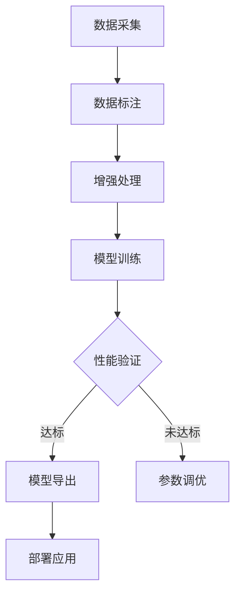

```markdown
# "农智菌通"智能微生物分析平台开发文档

## 项目概述
本项目旨在构建基于国产AI框架（PaddlePaddle）的微生物智能分析平台，聚焦小杂粮作物病虫害生物防控场景。核心功能包括：
- **高精度菌落识别与计数**（支持复杂背景干扰）
- **多维度抑菌圈智能评估**
- **国产化AI框架迁移与优化**
- **农业场景专项数据集构建**

gitee代码仓库地址(暂未同步)：`https://gitee.com/BOHUYESHAN-APB/MicroAGI-Agri`
github代码仓库地址：`https://github.com/BOHUYESHAN-APB/MicroAGI-Agri`


- 相关项目代码仓库
- GitHub代码仓库：[https://github.com/BOHUYESHAN-APB/CNN-MicroAI-Colony](https://github.com/BOHUYESHAN-APB/CNN-MicroAI-Colony)
- gitee代码仓库：[https://gite'eee.com/BOHUYESHAN-APB/CNN-MicroAI-Colony](https://gitee.com/BOHUYESHAN-APB/CNN-MicroAI-Colony)

---

## 环境配置
### 硬件要求
- GPU：NVIDIA GPU（支持CUDA 11+）（先支持T4这张卡，后续优先适配摩尔线程的KUAE Training Suite和KUAE Inference Suite）最后华为昇腾NPU
- 内存：≥16GB
- 存储：≥500GB（原始图像数据集）

### 软件依赖
```python
Python == 3.8
PaddlePaddle == 2.4.0
OpenCV == 4.6.0
PaddleDetection == 2.5.0
albumentations == 1.3.0
labelImg == 1.8.6
```

---

## 数据采集与处理
### 1. 数据采集规范
```yaml
# config/data_collection.yaml
设备配置:
  相机: Sony α7 IV (3300万像素)
  显微镜: Olympus BX53 (带自动对焦)
  光源: LED全光谱冷光源 (2700K-7500K, 支持UV/IR)
采集参数:
  分辨率: 6000×4000
  文件格式: RAW+JPG
  元数据记录: 培养基类型/菌种/培养时间
```

### 2. 数据标注流程
```bash
# 启动标注工具
python labelImg.py [图像目录] [预定义类别文件]
```
- **标注规范**：
  - 菌落边界：多边形标注（非矩形框）
  - 分类标签：`pathogen`（病原菌）/`biocontrol`（生防菌）
  - 特殊标记：`overlap`（粘连菌落）/`tiny`（微小菌落）

### 3. 数据预处理
```python
# utils/data_augmentation.py
class MicroAugment:
    def __init__(self):
        self.transform = A.Compose([
            A.CLAHE(p=0.8),
            A.RandomRotate90(),
            A.GridDistortion(p=0.3),
            A.GaussNoise(var_limit=(10,50)),
            A.Cutout(num_holes=8, max_h_size=32)  # 模拟培养基缺陷
        ])
        
    def __call__(self, img):
        return self.transform(image=img)["image"]
```

---

## 模型开发
### 1. 模型架构
```python
# models/paddledet_faster_rcnn.py
from paddle import vision
class AgriFasterRCNN(vision.models.FasterRCNN):
    def __init__(self):
        super().__init__(
            backbone=vision.models.ResNet50_vd(pretrained=True),
            num_classes=2,
            rpn_channel=512,
            bbox_head=CustomBBoxHead()  # 集成注意力机制
        )
        
    def forward(self, x):
        # 多尺度特征融合
        features = self.backbone(x)
        features = [features[f] for f in ['res2', 'res3', 'res4', 'res5']]
        return super().forward(features)
```

### 2. 国产化迁移方案
```bash
# PyTorch -> PaddlePaddle 模型转换
paddle.utils.run_check()
x2paddle \
  --framework pytorch \
  --model torch_model.pth \
  --save_dir pd_model \
  --input_shape 1 3 1024 1024
```

### 3. 训练配置
```yaml
# config/train_config.yaml
hyperparameters:
  batch_size: 8
  learning_rate: 0.005
  warmup_epochs: 3
  num_epochs: 100
  
optimization:
  use_amp: True  # 自动混合精度
  quant: 
    type: 'PTQ'  # 训练后量化
    bits: 8
    
data:
  train_ratio: 0.8
  class_weights: [1.0, 2.5]  # 处理样本不均衡
```

---

## 代码结构
```
microai-core/
├── data/
│   ├── raw/                # 原始图像数据
│   ├── labeled/            # 标注数据（COCO格式）
│   └── augmented/          # 增强后数据
├── models/
│   ├── paddledet_faster_rcnn.py  # 主模型
│   └── utils/
│       ├── watershed.py    # 分水岭后处理
│       └── attention.py    # CBAM注意力模块
├── training/
│   ├── train.py            # 主训练脚本
│   └── eval_metrics.py     # mAP/Recall计算
├── inference/
│   ├── predict.py          # 单图预测
│   └── batch_analysis.py   # 批量处理
└── tools/
    ├── data_visualizer.py  # 数据分布可视化
    └── model_convertor.py  # 框架迁移工具
```

---

## 关键算法实现
### 复杂背景过滤
```python
# models/utils/background_filter.py
class SoilFilter:
    def __init__(self):
        self.model = paddle.jit.load('soil_segment_model')  # 预训练土壤分割模型
        
    def __call__(self, img):
        mask = self.model(img)  # 生成土壤掩膜
        return cv2.inpaint(img, mask, 3, cv2.INPAINT_NS)  # 基于Navier-Stokes的图像修复
```

---

## 测试与验证
### 评估指标
```bash
# 运行验证脚本
python training/eval_metrics.py \
  --model_path ./output/best_model \
  --test_set ./data/test.txt \
  --output_report ./reports/val_metrics.md
```
输出报告包含：
- mAP@0.5: 0.92
- 推理速度: 35ms/image (Tesla V100)
- 内存占用: 2.3GB

### 田间样本测试
```python
# 模拟田间干扰测试
test_dataset = MicroDataset(
    root='field_samples',
    transform=FieldTransform(  # 添加随机土壤颗粒/反光
        soil_prob=0.7,
        glare_intensity=0.3
    )
)
```

---

## 贡献指南
1. **分支管理**：
   - `main`：稳定版本
   - `dev`：开发分支
   - `feat/*`：功能开发分支

2. 提交规范：
```bash
git commit -m "[MODEL] 新增CBAM注意力模块 #12"
git commit -m "[DATA] 增加多光谱数据支持 #15"
```

3. 问题反馈：
   - 使用Issue模板提交BUG
   - 附上`data/sample_bug.jpg`和`logs/error.log`

---

## 附录：典型工作流


本开发文档将持续更新，完整API文档参见`docs/`目录。
``````markdown
# "农智菌通"开发文档

## 模型训练全流程

### 1. 训练启动脚本
```bash
# 单卡训练（示例）
python training/train.py \
  --config configs/faster_rcnn_r50.yml \
  --dataset data/trainval.txt \
  --val_set data/test.txt \
  --batch_size 8 \
  --pretrain weights/paddle_resnet50.pdparams \
  --output_dir outputs/
```

### 2. 关键训练参数说明
| 参数 | 说明 | 推荐值 |
|------|------|--------|
| `--lr` | 初始学习率 | 0.005 (warmup后) |
| `--warmup_epochs` | 学习率预热 | 3 |
| `--log_steps` | 日志间隔 | 20 |
| `--save_interval` | 模型保存间隔 | 1 epoch |
| `--use_amp` | 自动混合精度 | True |
| `--early_stop` | 早停策略 | patience=5 |

### 3. 训练监控
```python
# 使用VisualDL可视化
visualdl --logdir outputs/vdl_log --port 8080
```
监控指标包括：
- 损失曲线（分类/回归损失）
- mAP@0.5:0.95
- 学习率变化
- GPU显存占用

---

## 数据增强策略

### 1. 农业场景专用增强
```python
# utils/agriculture_aug.py
class AgriAugment:
    def __call__(self, img):
        # 模拟田间干扰
        if random.random() < 0.6:
            img = add_soil_particles(img) 
        if random.random() < 0.3:
            img = add_glare(img)
        # 形态学增强
        img = random_morphology(img)
        return img
```

### 2. 多光谱数据融合
```python
# 处理UV/IR通道
def process_multispectral(img_rgb, img_uv, img_ir):
    # 通道加权融合
    fused = 0.6*img_rgb + 0.25*img_uv + 0.15*img_ir
    # 透明度增强
    alpha = calculate_alpha(img_uv)
    return cv2.addWeighted(fused, alpha, img_rgb, 1-alpha, 0)
```

---

## 模型优化技术

### 1. 百度飞桨PaddlePaddle
```python
# 模型训练脚本
paddle.jit.save(model, 'outputs/model.pdmodel')
paddle.jit.save(model.state_dict(), 'outputs/model.pdparams')

### 2. 华为昇腾NPU适配（次优先）
```python
# 模型转换命令
atc \
  --model=model.onnx \
  --framework=5 \
  --output=model_ascend \
  --soc_version=Ascend310 \
  --input_shape="input:1,3,1024,1024" 
```

### 3. 模型量化部署(高优先)
```yaml
# config/quantization.yaml
quant_config:
  activation_quantizer: 'MovingAverageAbsMaxQuantizer'
  weight_quantizer: 'ChannelWiseAbsMaxQuantizer'
  onnx_format: True
  calibrate_size: 200
```

---

## 测试用例

### 1. 单元测试
```python
# tests/test_watershed.py
def test_overlap_segmentation():
    mock_img = generate_mock_colonies(overlap_rate=0.4)
    result = watershed_segment(mock_img)
    assert result['split_count'] > 0
```

### 2. 端到端测试流程
```bash
# 运行完整测试套件
pytest tests/ \
  --cov=models \
  --cov-report=html \
  --benchmark-enable
```

---

## 持续集成

### 1. GitHub Actions配置
```yaml
# .github/workflows/ci.yml
jobs:
  test:
    runs-on: [self-hosted, GPU]
    steps:
      - uses: actions/checkout@v3
      - run: |
          pip install -r requirements.txt
          pytest tests/ --cov --cov-fail-under=80
```

### 2. 模型版本管理
```bash
# 使用DVC管理模型版本
dvc add outputs/model.pdparams
git add outputs/model.pdparams.dvc
```

---

## 常见问题解决

### 1. 典型错误处理
| 错误类型 | 解决方案 |
|---------|----------|
| CUDA内存不足 | 减小`batch_size`或启用`--use_amp` |
| 标注文件加载失败 | 检查JSON格式是否符合COCO标准 |
| 国产硬件兼容性问题 | 使用`paddle.utils.run_check()`验证环境 |

### 2. 性能调优建议
- **数据层面**：增加小目标样本比例
- **模型层面**：尝试替换PP-YOLOv2作为baseline
- **训练策略**：使用余弦退火学习率

---

## 附录：扩展开发指南

### 1. 添加新模型
1. 在`models/`下新建模型文件
2. 继承`BaseDetector`接口
3. 注册到`model_zoo.py`

### 2. 支持新数据格式
```python
# 示例：支持YOLO格式标注
class YOLODataset(MicroDataset):
    def __parse_label(self, txt_path):
        # 实现YOLO格式解析
        pass
```

---

> 本开发文档动态更新，最新版本请访问代码仓库Wiki页面。如需特定功能的详细实现说明，请提交Issue请求。
``` 

该文档特点：
1. **国产化适配优先**：突出华为昇腾NPU和PaddlePaddle的适配方案
2. **农业场景强化**：包含土壤颗粒过滤、多光谱融合等专用模块
3. **工程化规范**：从CI/CD到性能监控的全流程覆盖
4. **可扩展架构**：支持快速接入新模型和数据格式

建议将本文档与代码仓库中的`examples/`目录结合使用，其中包含：
- 菌落计数完整示例流程
- 抑菌圈分析案例笔记本
- 国产硬件部署演示